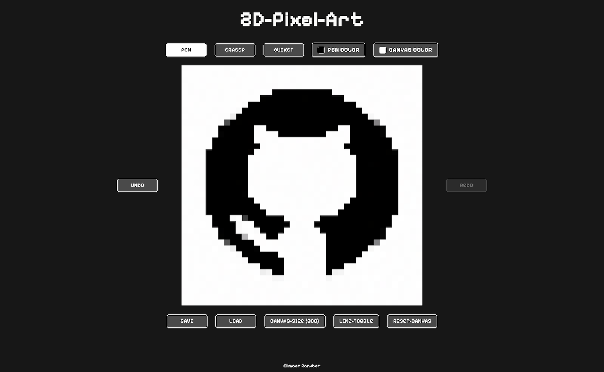

# 2D Pixel Art

## About

2D Pixel Art is a simple website for creating 2D pixel artwork on a fixed-size grid. It provides essential features such as pen, eraser, and bucket-fill tools; customizable pen and canvas colors; grid visibility controls; undo and redo history; and PNG import and export. The responsive interface supports mouse, touch, and stylus input, allowing the editor to work across both desktop and smaller devices.

The application is built with React and TypeScript, styled with Tailwind CSS, and developed and bundled with Vite. Drawing is powered by the HTML Canvas 2D API, while Pointer Events provide support for mouse, touch, and stylus input. Browser File, Blob, and ImageBitmap APIs handle PNG loading and downloading. The application runs entirely in the browser and is deployed through GitHub Pages.

This project started as a simple implementation of The Odin Project’s Etch-a-Sketch assignment, with additional inspiration from Pixilart.com. Since then, it has grown into a more complete pixel-art editor with additional drawing tools, import and export functionality, and responsive support for smaller screens.

## Live App

You can try out the **live version of the website** here:

👉 [**2D-Pixel-Art**](https://mjollnir03.github.io/2D-Pixel-Art/)

## Website Demo

  

  <em>Desktop Screen</em>

## References

This project is based on an earlier version of my 2D-Pixel-Art project. The original implementation is still available in this repository on the [old-version branch](https://github.com/mjollnir03/2D-Pixel-Art/tree/old-version).

## Conclusion

2D Pixel Art represents the evolution of a simple Etch-a-Sketch exercise into a more complete and interactive drawing application. Rebuilding the project with React and TypeScript provided an opportunity to apply modern frontend development concepts while working directly with the Canvas API, browser events, application state, and client-side file handling.

The project also served as a practical exercise in improving an existing application rather than simply starting from scratch. Comparing the current version with the original implementation highlights the progress made in both the codebase and the overall user experience.
